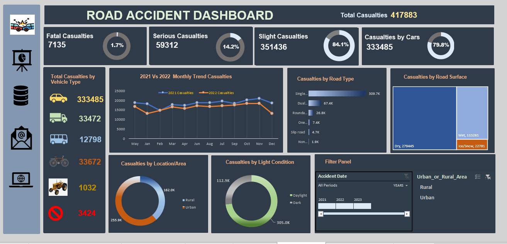

# Insights-from-Accident-Data-with-Excel-Dashboard

## Introduction:
Hello everyone, in this documentation, I'm going to present an analysis of a dataset containing information about road accidents. 
The dataset consists of 21 columns and 2417718 rows of data, 
My goal is to explore the relationships between different variables in the dataset and identify patterns and trends that can inform road safety initiatives. This will also show my data transformation and visualization skills.

 #### The Dataset

## Problem Statement:
In this project, I analyzed the accident dataset from the UK between 2021 and 2022 to identify the factors that increase the likelihood and severity of accidents. Through the analysis, I aim to determine if certain days of the week or times of the day are more prone to accidents, if specific weather and road surface conditions increase the likelihood of accidents, and if certain vehicle types or road hazards are more likely to cause accidents. The results of this analysis can help policymakers, road safety advocates, and stakeholders to implement effective measures to prevent accidents and improve road safety in the UK.

## Skills Demonstrated:
This dataset was clean with no duplicates, missing values or formatting issues to correct. I however **transformed** the Accident Date column by extracting the months and year from the using excels text function.

Next, I used **data transformation techniques** such as pivoting and grouping to restructure the dataset and make it easier to analyze. This involved combining similar values in different columns, creating calculated columns based on existing data, and creating pivot tables to summarize the data.

Finally, I used **data visualization** techniques to communicate my findings in a clear and concise manner. This involved creating graphs, charts, and other visual aids to represent the data and highlight trends and patterns.

Overall, my skills in **data transformation**, and **data visualization** were instrumental in ensuring the accuracy and usefulness of the road accident dataset and in communicating my findings to stakeholders effectively.

## Data Source:
To conduct the analysis for this project, I used a road accident dataset that is available from kaggle through this link:https://www.kaggle.com/datasets/devansodariya/road-accident-united-kingdom-uk-dataset

## Data Transformation Process:
- I used Pivot Tables extensively to summarize key columns of interest, including "Number of Casualties," "Accident Severity," "Light Condition," "Road Type," "Urban or Rural Area," "Weather Condition," and "Vehicle Type."
- I developed both Primary Key Performance Indicators (KPIs) and Secondary Key Performance Indicators(KPIs) based on the summarized data.
- To present my findings and analysis, I utilized a variety of charts, including doughnut charts, line charts, and tree maps.
- I leveraged the powerful pivot table feature in Excel to transform raw data into meaningful insights.
- Through this process, I developed a deep understanding of the factors that contribute to road accidents and identified key areas where action can be taken to improve road safety.

### Primary KPIs

## Analysis and Visualization:

- Total Casualties: I used a pivot table to summarize the "Number of Casualties" column and created a doughnut chart that shows the breakdown of total casualties by severity level (fatal, serious, slight) and by vehicle type. This KPI provides a quick overview of the severity and types of accidents in the dataset.
- Monthly Trend Analysis: I created a line chart that shows the trend of total casualties over time, with a focus on monthly trends. This KPI helps to identify any seasonal patterns in accidents and can inform targeted interventions.
- Casualties by Road Types: I used a pivot table to summarize the "Road Type" column and created a bar chart that shows the number of casualties by road type. This KPI helps to identify which types of roads are most dangerous and where interventions may be most effective.
- Casualties by Road Surfaces: I used a pivot table to summarize the "Road Surface Conditions" column and created a tree map that shows the number of casualties by road surface. This KPI helps to identify which road surfaces are associated with higher accident rates.
- Casualties by Location/Area and Light Condition: I used a pivot table to summarize the "Urban or Rural Area" and "Light Conditions" columns and created a doughnut chart that shows the number of casualties by location/area and light condition. This KPI helps to identify the areas and conditions where accidents are most likely to occur.
- Slicer and Filter: I added a slicer and filter for accident dates to the dashboard, making it easy for users to adjust the date range and see trends over time.
- Overall, my analysis and visualization of the road accident data set provides valuable insights into the factors that contribute to accidents and will help inform policy and decision-making on road safety.

## Accident Dashboard

*To get the complete Excel project File, use this link: https://drive.google.com/file/d/1eYK7phyVPGUMsqZG6hzbLGHEwyn8KvQe/view?usp=share_link

## Recommendations:
- To reduce the number of casualties, policymakers and road safety advocates should focus on improving road safety measures such as increasing road signage, improving road lighting, and enforcing speed limits.
- The analysis shows that certain vehicle types such as cars, agricultural vehicles, van and bikes are involved in more accidents. Therefore, there is a need for policies that target these specific vehicle types to enhance their safety features and ensure proper training for drivers of these vehicles.
- Based on the analysis, it is evident that dry road surface had the highest number of accidents. Policymakers should invest in road maintenance to ensure that road surfaces are in good condition to reduce the likelihood of accidents, especially during dry condition.
- The analysis reveals that accidents are more likely to happen during the day. Policymakers should enforce measures such as increasing the visibility of pedestrians and other road users during the day and also improve pedestrian crossing facilities.
- The analysis shows that urban areas have a higher number of casualties than rural areas. Policymakers should focus on implementing measures that improve road safety in urban areas, such as improving pedestrian crossings and implementing traffic calming measures.

These recommendations can be used as a guide for policymakers, road safety advocates, and other stakeholders to take necessary steps to prevent accidents and ensure road safety.

## Conclusion:
In conclusion, the analysis of the road accident data indicates that there is a need for increased road safety awareness campaigns, improved road infrastructure, and more stringent enforcement of traffic rules. The government, stakeholders, and other concerned parties should work together to ensure that these recommendations are implemented to reduce the number of casualties on our roads.

## 

